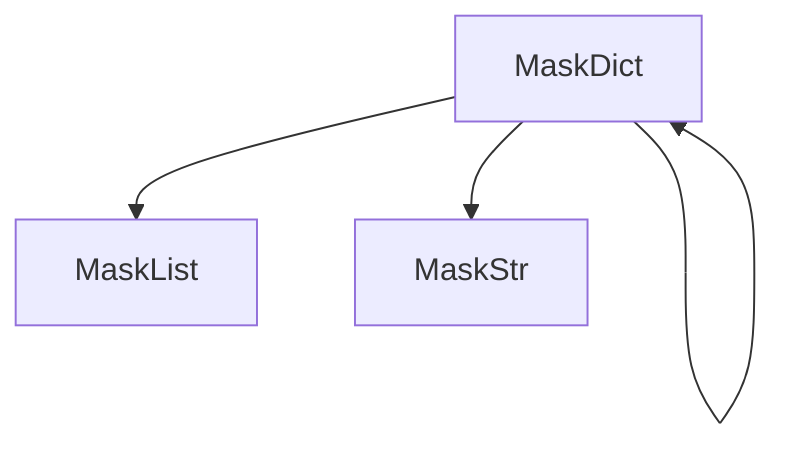
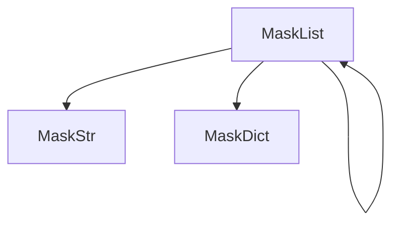

If you've made it this far then you want to know more about anonymize-data

### Installation



### What are the classes called?

!!! note
    It can be seen that the classes together cause a cascading effect, they call each other if the data type matches the class.





### Anonymizing only selected keys from a dictionary

If you do not want all data to be anonymized, you can pass a list of keys that should be anonymized.

```python
from anonymizer import MaskDict
dict_data = MaskDict(
    {
        "username": "JhonDoe",
        "password": "123Change",
        "roles": ['Admin', 'developer'],
        "contact": {
            "number": "+55 (99) 99999-9999"
        }
    }, selected_keys=['password', 'number']
)
dict_data.anonymize()
print(dict_data)  # {'username': 'JhonDoe', 'password': '******nge', 'roles': ['Admin', 'developer'], 'contact': {'number': '*************9-9999'}}
```

### Using unique anonymization through dictionary keys

The main purpose of having mask types for specific data is to try to facilitate development, the lib itself has a "bank" of sensitive data keys that will be anonymized by default if the `key_with_type_mask` parameter is `True`.

```python
from anonymizer import MaskDict
dict_data = MaskDict(
    {
        "username": "JhonDoe",
        "password": "123Change",
        "roles": ['Admin', 'developer'],
        "contact": {
            "number": "+55 (99) 99999-9999",
            "email": "jhondoe.09@example.com"
        }
    }, key_with_type_mask=True
)
dict_data.anonymize()
print(dict_data)  # {'username': '*******', 'password': '*********', 'roles': ['Admin', 'developer'], 'contact': {'number': '*******************', 'email': '*********9@example.com'}}
```

This unique anonymization is basically a custom anonymization for some data types that are registered programmatically in the dispatch of handlers.

example for the type "cpf":
```python
from faker import Faker
from anonymizer import MaskStr

fake = Faker('pt_BR')
cpf_mask = MaskStr(fake.cpf(), type_mask='cpf').anonymize()
print(cpf_mask)  # Result: ***.739.***-**
```

Each dictionary key is passed as type_mask for the value when masked, anonymization occurs by the `MaskStr` class.

Example:
```python
from anonymizer import MaskStr
string = MaskStr("+55 (11) 91234-5678", type_mask="phone")
string.anonymize()
print(string)  # result: +** (**) *****-*678
```

!!! warning
    The `size_anonymization` parameter is only used by the "string" mask type, i.e., this parameter has no effect if you pass a different `type_mask`.

The mask type is passed to the classes that are instantiated in cascades. Example when we pass a type_mask to a `MaskList`:

Example:
```python
from anonymizer import MaskList
phones = MaskList(["+55 (11) 91234-5678", "123-456-7890", "9876543210"], type_mask="phone")
phones.anonymize()
print(phones)  # result: ['+** (**) *****-*678', '***-***-*890', '*******210']
```

    

### Data Mask Types

Mask Types:

